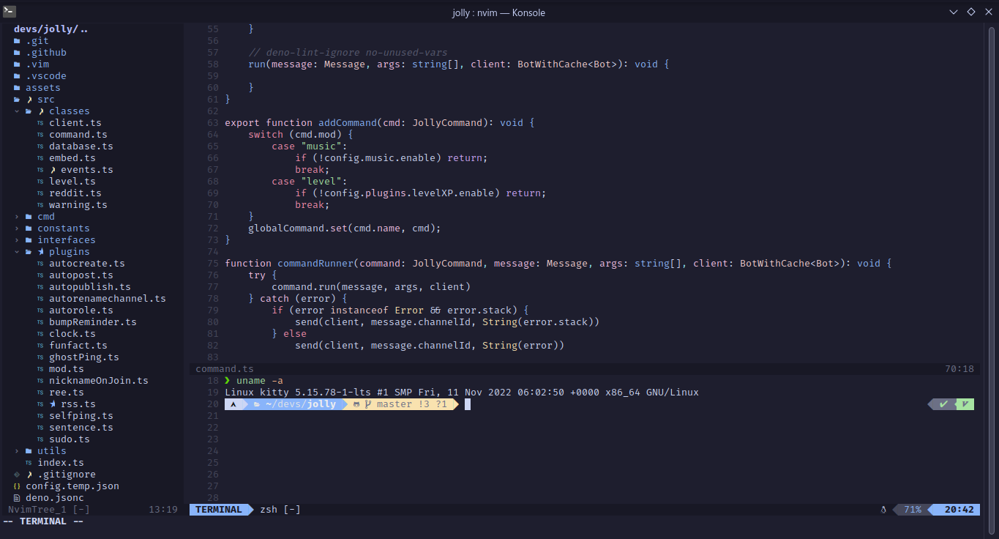

# Nvim dotfile

A simple nvim rice using catppuccin. Nothing else lol

# Setting up

Clone this repo to `~/.config/nvim` (it will override your init.vim)

Finally, use `:PlugInstall` and restart nvim to apply the whole.